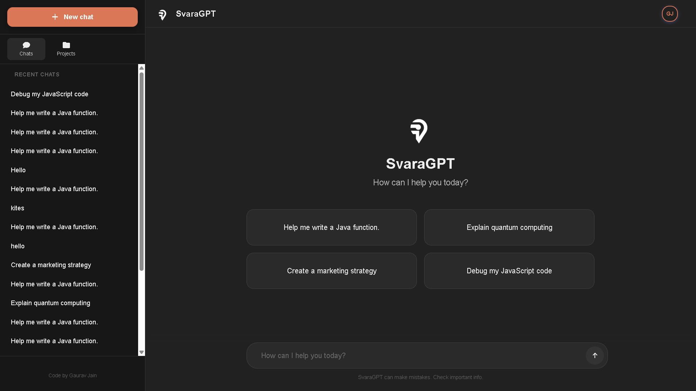
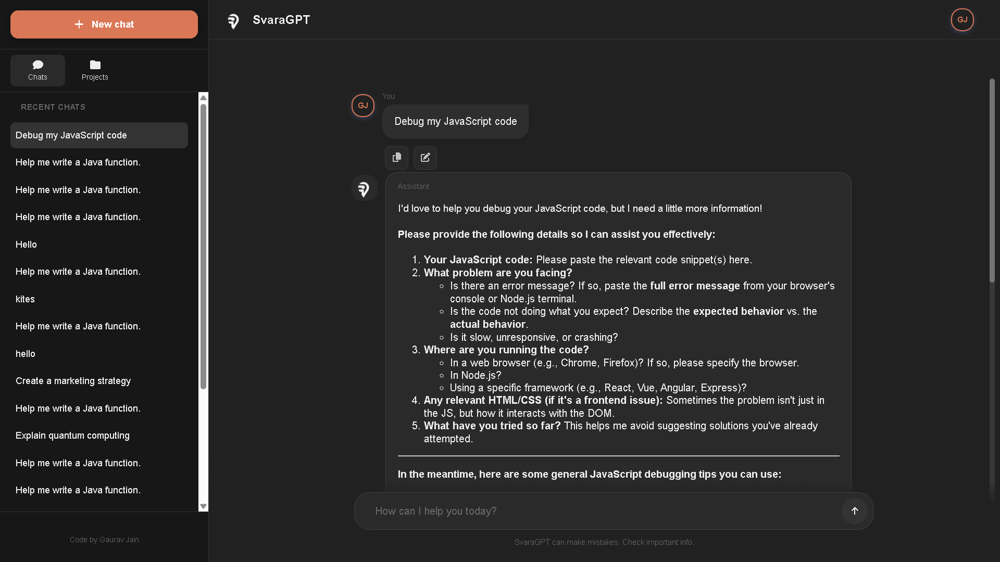

# SvaraGPT


> Premium, responsive, and secure AI assistant — built with React + Express.

---

## Table of Contents
- [About](#about)
- [Features](#features)
- [Tech Stack](#tech-stack)
- [Screenshots](#screenshots)
- [Folder Structure](#folder-structure)
- [Installation](#installation)
- [Environment Variables](#environment-variables)
- [Running](#running)
- [Theme Switching](#theme-switching)
- [API Overview](#api-overview)
- [Contributing](#contributing)
- [License](#license)
- [Contact](#contact)
- [Future Enhancements](#future-enhancements)

---

## About
SvaraGPT is a modern AI-powered web application that delivers a polished chat experience with a premium UI. It supports dark and light themes, a responsive layout with a mobile-style collapsible sidebar, and a robust backend for authentication, sessions, projects, and chat threads. It integrates with Google Gemini to generate interactive text responses, and is built for both guest and authenticated flows.

Key goals:
- Clean, distraction-free interface without unwanted shadows or overlapping components
- Responsiveness and accessibility across devices and screen sizes
- Secure session management and scalable data storage
- Simple local development with clear environment setup

---

## Features
- 🌓 Theme Modes: Default dark theme with seamless light mode, including color fixes and CSS variables
- 📱 Responsive UI: Mobile-first layout with collapsible sidebar and hamburger toggle on medium screens
- 🔒 Auth & Security: Email verification, optional 2FA, session management and device listings
- 💬 AI Chat: Interactive text generation via Gemini models with edit, regenerate, and feedback on messages
- 🧭 Clean UX: Minimal visual noise, clear component boundaries, and consistent spacing
- 🧰 Project & Threads: Organize conversations by projects and threads with rename, delete, and CRUD operations
- 🌐 CORS-Safe: Strict origin handling with production-friendly defaults

---

## Tech Stack
- Frontend: React 19, Vite, React Router
- Styling: Vanilla CSS with theme variables, Font Awesome icons
- Backend: Node.js, Express 5, Mongoose
- Database: MongoDB
- AI: Google Gemini via `@google/genai`
- Auth: Sessions + Passport (Google OAuth)
- Utilities: JWT, Resend (Email), GeoIP

---

## Screenshots
- 
- 
- 
---

## Folder Structure
```
SvaraGPT/
├── backend/
│   ├── config/
│   ├── middleware/
│   ├── models/
│   ├── routes/
│   ├── utils/
│   └── server.js
└── frontend/
    ├── src/
    │   ├── assets/
    │   ├── components/
    │   ├── context/
    │   ├── utils/
    │   ├── App.jsx / App.css
    │   ├── ChatWindow.jsx / ChatWindow.css
    │   ├── Sidebar.jsx / Sidebar.css
    │   ├── main.jsx
    │   └── index.css
    ├── vite.config.js
    └── package.json
```

---

## Installation
- Prerequisites: Node.js 18+, npm, MongoDB instance
- Clone:
```
git clone https://github.com/gauravjain0377/SvaraGPT.git
cd SvaraGPT
```
- Backend setup:
```
cd backend
npm install
```
- Frontend setup:
```
cd ../frontend
npm install
```

---

## Environment Variables
- Backend `.env` example:
```
PORT=8080
MONGODB_URL=your_mongodb_connection_string
SESSION_SECRET=your-secure-session-secret
JWT_SECRET=your-secure-jwt-secret
FRONTEND_URL=http://localhost:5173
COOKIE_SECURE=false
COOKIE_SAME_SITE=none
# COOKIE_DOMAIN=localhost

# Email (Resend)
RESEND_API_KEY=re_your_resend_api_key

# Google Gemini
GOOGLE_API_KEY=your-gemini-api-key

# Google OAuth
GOOGLE_CLIENT_ID=your-google-client-id
GOOGLE_CLIENT_SECRET=your-google-client-secret
GOOGLE_CALLBACK_URL=http://localhost:8080/auth/google/callback
```
- Frontend `.env` example:
```
VITE_API_BASE_URL=http://localhost:8080
```

---

## Running
- Development:
```
# Terminal 1 — backend
cd backend
node server.js

# Terminal 2 — frontend
cd frontend
npm run dev
```
- Production (basic):
```
# Build frontend
cd frontend
npm run build

# Run backend with production vars
cd ../backend
NODE_ENV=production node server.js
```

---

## Theme Switching
- The theme state is managed in `frontend/src/context/ThemeContext.jsx` (frontend/src/context/ThemeContext.jsx:26-33) using a `data-theme` attribute on `documentElement`.
- CSS variables are defined in `frontend/src/index.css` (frontend/src/index.css:1-20 for dark, 22-40 for light). Switching toggles between `:root` and `[data-theme="light"]` values.
- Persisted in `localStorage` with default `dark`. Toggle with a button wired to `toggleTheme()`.

---

## API Overview
- Base URL: `VITE_API_BASE_URL` (frontend/src/utils/apiConfig.js:1-17)
- Root: `GET /` — health/status message (backend/server.js:112-119)
- Models: `GET /api/models` — list Gemini models (backend/routes/chat.js:21-49)
- Threads: `GET /api/thread` — list threads (backend/routes/chat.js:112-121)
- Thread: `GET /api/thread/:threadId` — get messages (backend/routes/chat.js:124-139)
- Chat: `POST /api/chat` — send a message, returns AI reply (backend/routes/chat.js:179-305)
- Edit Message: `PATCH /api/chat/:threadId/messages/:messageId` (backend/routes/chat.js:307-361)
- Regenerate: `POST /api/chat/:threadId/messages/:messageId/regenerate` (backend/routes/chat.js:363-399)
- Feedback: `POST /api/chat/:threadId/messages/:messageId/feedback` (backend/routes/chat.js:401-433)

Guest usage limits and guards are applied via middleware (backend/middleware/guestOrAuthGuard.js).

---

## Contact
**Developed by:** Gaurav Jain  
**Email:** [jaingaurav906@gmail.com](mailto:jaingaurav906@gmail.com)  
**LinkedIn:** [linkedin.com/in/this-is-gaurav-jain/](https://www.linkedin.com/in/this-is-gaurav-jain/)  
**GitHub:** [github.com/gauravjain0377](https://github.com/gauravjain0377)  
**𝕏:** [x.com/gauravjain0377](https://x.com/gauravjain0377)

---

## Future Enhancements
- Streaming responses with token-by-token updates
- Multi-model routing (Gemini, OpenAI, local LLMs)
- Attachments: images/files for multimodal prompts
- Role-based access with admin dashboard
- Analytics: usage charts, feedback insights
- PWA + offline caching for recent threads
- Internationalization (i18n)
- E2E tests and CI pipeline

---

Crafted for developers and users who value speed, clarity, and polish.
